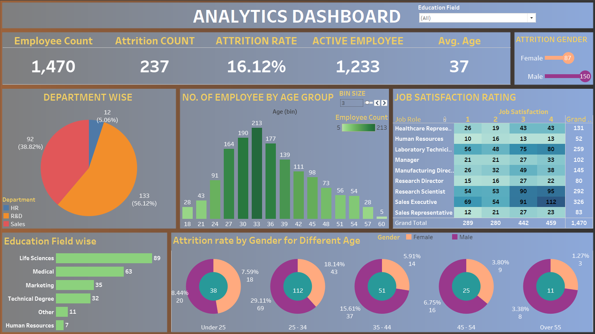

# Employee Data Analysis Dashboard

## Project Description
This project is an **Employee Data Analysis Dashboard** developed using **Tableau**. The dashboard provides insights into various employee attributes, such as attrition rates, job satisfaction, department-wise distribution, age group analysis, and educational qualifications. It is designed to help organizations understand employee trends and make data-driven decisions.

---

## Dashboard Preview


---

## Features
- **Employee Overview**: Displays the total employee count, active employees, and attrition rate.
- **Department-Wise Analysis**: Visualizes the distribution of employees across different departments (HR, R&D, and Sales).
- **Age Group Distribution**: Highlights employee count in various age bins.
- **Education Field**: Provides attrition statistics based on the educational background.
- **Attrition by Gender and Age**: Analyzes attrition trends segmented by gender and age.
- **Job Satisfaction Rating**: Displays job satisfaction levels for various roles.

---

## Files in the Repository
1. **Dashboard Screenshot**: `employee_analysis_dashboard.png` (Screenshot of the Tableau dashboard)
2. **Tableau Workbook**: `employee_data_analysis.twbx` (Upload your Tableau workbook here)
3. **README.md**: This file.

---

## Tools Used
- **Tableau Desktop**: For data visualization and creating the dashboard.
- **GitHub**: For project versioning and sharing.

---

## How to Use This Repository
1. Clone the repository using:
   ```bash
   git clone https://github.com/Sourabh-BA/Employee-Data-Analysis.git
